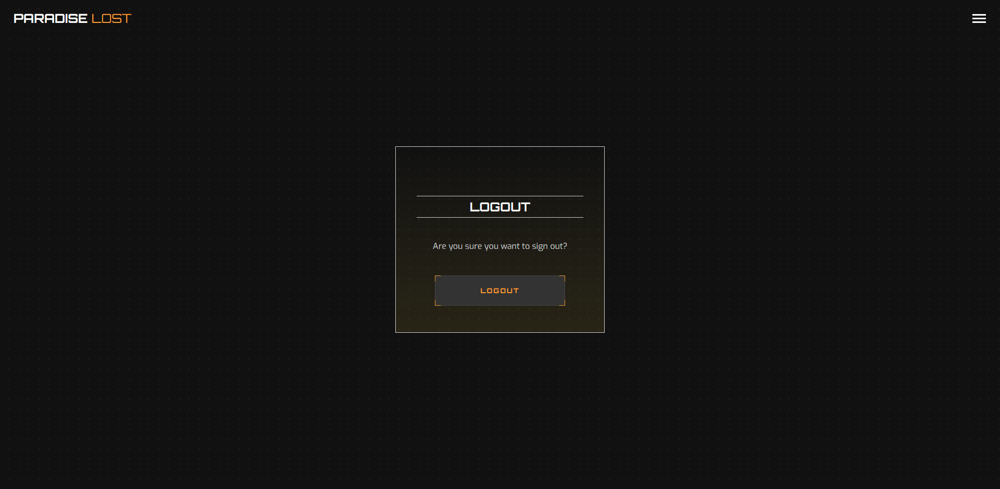
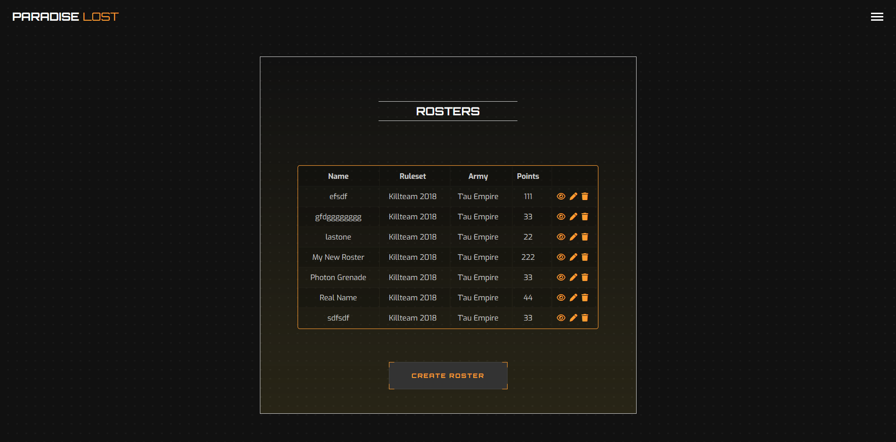

# Paradise Lost

A website for managing armies for tabletop board gaming.

[Paradise Lost - Live Website](https://paradise-lost-app.herokuapp.com/)

  

Paradise Lost is a community-based platform to allow users to build and edit their armies, find people nearby to play with (should they want to opt into displaying their location), and make friends!

This is my fourth milestone project as part of Code Institute's Diploma in <strong>Software Development (E-commerce Applications)</strong>.

This project was suggested to me by my very close friend and fellow full stack developer, Simon W. He initially pitched this idea with me working on the front-end and him creating the back end using Crystal, which is a programming language with Ruby-like syntax and C-like speed. I agreed to this but wanted to use this idea for my Portfolio Project 4 due to it fitting my interests, as well as the assessment criteria in terms of scope. As such, the backend is built using Python and the Django web framework, whereas the front-end consists of the usual trifecta of HTML, CSS, and JavaScript.

Inspired by [Battle Scribe](https://www.battlescribe.net/), which utilises an application approach and is available on Windows, Apple Story, and Google Play. Unfortunately, many tabletop players have grown frustrated with Battle Scribe due to almost no development in past few years and this has become a bit of an open niche. This will be my humble attempt to create a website that fills this niche and hopefully provide a useful service to any aspiring commanders.

For the purpose of this project, Simon W. will be referred to as the client as he was the one that pitched the concept. It will be my goal to facilitate and actualise his vision.

## Table of Contents

1. [Paradise Lost](#paradise-lost)
2. [Planning Phase](#planning-phase)
    - [Strategy](#strategy)
      - [Site Aims](#site-aims)
      - [Opportunities ](#opportunities )
    - [Scope](#scope)
3. [User Experience](#user-experience)
    - [Target Audience](#target-audience)
    - [User Stories](#user-stories)
4. [User Interface](#user-interface)
    - [Design Philosophy](#design-philosophy)
      - [Colours](#colours)
      - [Typography](#typography)
    - [Wireframes](#wireframes)
    - [Database](#database)
5. [Agile Development Process](#agile-development-process)
6. [Features](#features)
    - [Logo](#logo)
    - [Landing Page](#landing-page)
    - [Navigation Menu - New User](#navigation-menu-new-user)
    - [Navigation Menu - Registered User](#navigation-menu-registered-user)
    - [Button](#button)
    - [About](#about)
    - [Register](#register)
    - [Login](#login)
    - [Forgot Your Password](#forgot-your-password)
    - [Logout](#logout)
    - [Dashboard](#dashboard)
    - [Change Your Password](#change-your-password)
    - [Roster List](#roster-list)
    - [Create Roster](#create-roster)
    - [Edit Roster](#edit-roster)
    - [View Roster](#view-roster)
    - [Delete Roster](#delete-roster)
    - [Error 404](#error-404)
    - [Error 505](#error-500)
    - [Favicon](#favicon)
7.  [Code](#code)
    - [Commits](#commits)
8. [Testing]
9. [Future Updates](#future-updates)
10. [Deployment](#deployment)
11. [Technologies Used](#technologies-used)
    - [Languages](#languages)
    - [Tools](#tools)
12. [Credits](#credits)
13. [Acknowledgements](#acknowledgements)

## Planning Phase

### Strategy

#### Site Aims

Building an army for a tabletop war game is no small feat. Hobbyists must buy unit models of a specific faction, assemble, paint, and organise them. If they then want to play against another person, they must transport them while making sure the models don't get damaged.

Amidst all that, every game has its own ruleset. Oftentimes, games have multiple. Put simply, there's more than one way to enjoy any particular game and this has led to the creation of various rulesets that cater to different demographics of players.

Keeping track of rulesets is tricky because each one tends to be in-depth and is usually accompanied by some thick rulebooks. As such, it can be difficult to remember which unit belongs to which army for which ruleset, and so on. Many players have taken to note-taking in journals and the like, but that is one more thing to remember to bring whenever they need to travel for games.

This application aims to streamline the process of players having to bring their physical notes everywhere. Instead, they can quickly and readily access their army rosters from the comfort of their mobile phones or computers.

Here they can create their army rosters, view them at their leisure, modify them as required, and even delete them should become unnecessary. Wherever you go, your army information is always with you.

#### Opportunities

The following was an extensive list of features that were brainstormed between Simon W. and I during the conceptualisation of the website. A feasibility chart was deemed important to prioritise the scope of the intended strategy.

| Opportunity             | Importance  | Feasibility   |
|------------------------ |------------ |-------------  |
| User Account Management      | 5           | 5             |
| Friend System           | 1           | 2             |
| Landing Page            | 5           | 5             |
| User Login, Logout, Register              | 5           | 5             |
| About Page              | 5           | 5             |
| User Profile            | 1           | 1             |
| Army Roster Management  | 5           | 4             |
| Roster Sharing          | 1           | 3             |
| Killteam 2018 Ruleset   | 5           | 3             |
| Error Pages             | 5           | 5             |
| **Total**               | **38**      | **33**        |

Feasibility is based on time and my current level of ability using languages.

### Scope

As there is an imbalance of 5 points in the above score, (38 vs 35), there will have to be trade-offs made due to the tight schedule of this project.

The above table has been further categorised in order to establish a clear vision of the MVP required while satisfying the above requirements.

- UX **Must's**:
  - User can login, logout, and register
  - User can create an army roster
  - User can edit an army roster
  - User can view their army rosters
  - User can delete their army rosters

- UX **Should's**:
  - User can use the "forgot your password" functionality
  - User can otherwise reset their password
  - Landing page
  - About page
  - Killteam Ruleset
  - Error pages

- UX **Should Not's**:
  - User profile
  - Friend system
  - Roster sharing
  - User can change their e-mail

## User Experience

### Target Audience

  - People who are looking to keep track of their rosters for table-top war gaming
  - People who are looking to replace their physical rosters notes with digital storage
  - Fans of tabletop games
  - Fans of sci-fi concepts

### User Stories

#### Unregistered Users

  1. As an unregistered user, I want to quickly understand the purpose of this website so that I can determine if I want to continue spending my time on this website and register.

  2. As an unregistered user, I want to easily navigate the menu without getting lost and see the uniformity of each page so that I know this website is worth my time and won't lead to any frustrations.

  3. As an unregistered user, I want to quickly and easily learn more about the website and its purpose if I am unable to infer its purpose from the visuals and text alone, so that I can decide if registering for this website would be beneficial to me.

  4. As an unregistered user, I want to be able to register for an account so that I can start building my army rosters.

#### Registered Users

  5. As a registered user, I want to be able to change my password should I forget so that I have peace of mind in knowing that I won't be locked out of my account.

  6. As a registered user, I want to be able to manage my account by changing my password so that I can avoid any security breaches or implement a stronger password.

  7. As a registered user, I want to be made aware of my account management actions so that I know they have been successful.

  8. As a registered user, I want to be able to access a user dashboard so that I have a base of operations for this website that's readily available.

  9. As a registered user, I want to be able to create my roster so that I can view it later.

  10. As a registered user, I want to be able to view my roster so that I can decide if it needs to have any changes made to it.

  11. As a registered user, I want to be able to update my roster so that I can make sure it's always up to date.

  12. As a registered user, I want to be able to delete my roster so that any old or unnecessary rosters don't use any unnecessary space.

#### Admins

  13. As an admin, I want to be able to log into an admin interface so that I can view, add, update, or delete information pertaining to the army rosters.

  14. As an admin, I want to be able to access the users for the website so that I can make any adjustments to their accounts such as changing their password or email, should they request it.

  15. As an admin, I want to be able to view a list of the users so that I know how many active users there are.

#### Site User

  16. As a site user, I want to be engaged by the user interface, indicating I will enjoy spending time building my rosters as I navigate the same menus repeatedly.

  17. As a site user, I want to be shown responses from the website upon interaction with it so that I know the creation, deletion, or update of my roster has been successful.

  18. As a site user, I want to experience a unique and uniform design with appealing colours so that every part of the website stimulates a positive response.

  19. As a site user, I want to be able to access the website from any screen size and still have a pleasant viewing experience, so that I'm not restricted to only viewing this website on bigger screens.

  20. As a site user, I want to be able to contact the admin via e-mail, find their GitHub project repository, or even find them on other socials like LinkedIn.

#### Dropped

Certain user stories were dropped as part of the agile process. They are as follows:

  - As a registered user, I want to be able make a profile so that I can share my roster via a link.
  - As a registered user, I want to be able to private my rosters so that they don't appear on my profile.
  - As a registered user, I want to view other people's profiles so that I can view their rosters.
  - As a registered user, I want to add other people as friends so that we can make rosters and play together.
  - As a registered user, I want to be able to delete a friend because they were very unsportsmanlike after beating me in a game.
  - As a registered user, I want to find nearby active players so that we can meet up and play games.
  - As an admin, I want to add headings to the admin database tables so I can more quickly understand my data.
  - As an admin, I want to filter the admin database tables so that I can more easily find the data I need.

## User Interface

### Design Philosophy

The design of this website began with a simple and clear vision: to replicate the menus present in old real-time strategy games, such as the Command & Conquer series. While navigating the many menus of the game, especially when choosing a location to start a campaign on Earth, the player can choose their starting location. While they're choosing, a hologram of the Earth will play on screen. While not exactly the same, [this video (timestamped)](https://youtu.be/j77gwvA2bQU?t=35), shows a very similar sequence.

My goal was first and foremost to replicate this sort of feeling: that the user is looking over the planet, ready to make their move. As such, I began scouring the website for a video that was not too long and looped perfectly, which is when I happened on Free Stock Videos by [Videezy](https://www.videezy.com/abstract/50298-futuristic-globe-world-earth-planet-in-cyberspace-with-binary-code). There's a great collection of high-quality videos that are free to use with attribution. This video in particular was exactly what I was looking for, it's a relatively short and perfect loop that features a rotating holograph of the planet.

The colour scheme was picked from this video, which serves as the landing page for the website. The rest of the UI was built around this colour scheme and inspiration. The button style used is reminiscent of a commanding officer making difficult decisions as the reticule focuses in. Of course this website does nothing so austere, this is just the feeling I wanted to evoke with my designs. The menus themselves are simple, sleek, angular, with a repeated dot background combined a semi-transparent black to yellow gradient.

The design of the UI was mostly made with a mobile-first approach. However, for the smallest viewports, the menus expand to 80-100% of the width to allow for easier viewing.

#### Colours

The below image was generated using [coolers.co](https://coolors.co/fd9c31-cccccc-ffffff). The orange is the colour that was picked from the landing page video, silver was often used for text, and the white was used for titles and as a form of contrast between the black and greys present throughout the site.

#### Typography

Two fonts were specifically chosen for this website:

- *Orbitron*

Orbitron was chosen due to its sleek look, which evokes the feeling of a futuristic sci-fi movie. As it is intended for display purposes, it was used for the logo and as text headings.

- *Exo*

Exo was chosen to compliment Orbitron as it also conveys a similarly futuristic yet elegant feeling. While it can also be used for headings, Exo looks much better at small text sizes, which is what it is used for in this project.

### Wireframes

The conceptualisation of the layout used in this project began with simple pen and paper sketches, which were then transformed into wireframes via Balsamiq. Everything shown here is a rough beta of the layout, some of which has changed during development.

This is the prototype of the project, which changes over the course of project development.

  
Home Page

  

  
Navigation Menu

  

  
General Menu

  

  
Roster

  

### Database

Above is the database schema as the initial plan for the database tables. Originally, we planned for users to be able to configure their rosters with units, specialisms, abilities, war gear, and weapon profiles. Unfortunately, this fell completely out of scope due to time constraints and unfamiliarity with a method of serialising those models in a way that's customisable to each user.

The user model was not included due to the default user model provided by the ALLAUTH library.

## Agile Development Process

[Jira](https://www.atlassian.com/software/jira) was used to create and track User Stories and issues. Login credentials will be provided for the above project space when the project is submitted. A summary of my agile process and learning outcomes can be found [here](https://github.com/Ryael/paradise-lost/blob/main/AGILE.md).

## Features

### Logo

No suitable icon was found for the logo and hence the Orbitron font was used for it instead. To create a sense of contrast "Paradise" was written in white, whereas "Lost" was written in orange and has lower font weight than "Paradise". This approach to text logo design achieves a sleek and unique look. As expected, interacting with the logo brings the user to the home/landing page.

### Landing Page

The landing page utilises a hero-video for its background, which loops perfectly every 10 seconds. Upon loading into the page, the user is greeted the video and the dynamically rotating text. The text rotates between synonyms for "army", "fleet", and other similar words every four seconds. Dynamically changing text is very [effective for user conversion](https://www.convertize.io/dynamic-text/) and creates an engaging landing page. This text is accompanied by a call-to-action button with the words "Enlist Now!", urging potential users to sign-up. Lastly, in the top right corner, a hamburger menu is visible which is used to expand a navigation menu.

### Navigation Menu - New User

The navigation menu opens with a smooth fade-in animation and the hamburger icon is replaced with an "X", informing the user that this "X" icon is what they should interact with should they want to close the navigation menu. The user is greeted by a dark gray "carbon-fiber" background with small dots, which consists of a small single dot image that is repeated. This allows the dot to scale to any viewport necessary without any stretching. The links themselves begin as white and when interacted with, all but the active one fade to grey. The social-icons on the bottom also function the same way.

The bottom of the navigation menu features the aforementioned social-icons which also double as the website's footer. This approach was opted for as full screen navigation menus are becoming increasingly popular, given they allow for greater focus on the true page content. Even if a stick navigation bar approach is utilised, it still uses a portion of the viewing space. The footer can also add unnecessary vertical scrolling. As this website aims to utilise the immediately available viewing space, full screen navigation menu was the ideal choice.

### Navigation Menu - Registered User

Similarly, to the new user example, the navigation menu changes the links available to the user depending on if they are authenticated or not. If they are not, the above example is what they will see. If they are, however, then they'll instead be shown the Registered User example with the Login and Register links replaced with Dashboard and Logout links.

### Button

All the buttons present on the website follow the same design: gray background with orange text and orange decorators on all corners. Upon interaction, the corners expand and float outwards. This effect was made to be reminiscent of an aiming reticle to give the website's buttons a more military-esque feeling, bolstering the site’s sci-fi army feel. The decorators and button text also both flicker upon loading and interaction, as a way of guiding the user.

### About

The about page is the one of the first pages the user will see should they want to learn more about the purpose of the website. The entirety of the page background is a dark gray with a similar (albeit more widely spaced) dot pattern to the navigation menu. However, this time the dot itself is generated with CSS, which allows it to expand infinitely as required by the viewport. Links are highlighted in orange and turn to white on mouse-over/interaction, providing the user with visual feedback.

### Register

This is one of the first menus a new user will see, if the landing page user conversion was successful. Upon loading into this page, the user is greeted by a centered menu with a white outline and input text fields outlined in that same orange colour, creating a consistent design throughout. Errors are rendered above their relevant text field and are styled in the same manner as regular paragraph text, meaning that the body text is consistently gray throughout. Additionally, a link to the login page is found at the bottom of the menu and highlighted in orange, instantly standing out to the user who may be looking just to login. The button for the input is same as other buttons showcased earlier. This will be consistent for every other button on this website.

### Login

Logging in is an important process for any website with features locked behind user registration. As such, login menu itself is simple and short. The user is also provided with a remember-me checkbox, with its opacity reduced ever-so-slightly to make it fit in with the overall colour scheme of the menu. Upon it being checked, it becomes highlighted in the usual orange colour. The user is also presented with two links at the bottom of the menu, one linking them back to the register page and the one below that allowing them to use the "Forgot your password" functionality which allows them to reset their password via email.

### Forgot Your Password

In terms of design, this section is consistent with the above menus. Upon entering the email the user used for registration, they're able to request a link via email to reset their password. Once that link is used, the user is redirected to the reset password page where they are given a chance to input a new password and then confirm that same password. They are then brought to a new page where they are informed their password has been successfully changed.

### Logout

Should the user want to logout, they are brought to one of the smallest menus across the entire website. It's centered vertically and horizontally, which admittedly does stand out. However, this is intentional as the very small menu box looks out of place when it's placed in the same location as the other menus. Upon logging out, the user is not provided with any text but instead is brought to the landing page as is standard. The links in the navigation menu also revert to "Register" and "Login".

### Dashboard

Upon successful registration or login, the dashboard page is the first thing the user will see. While there is no message printed to inform the user that their login has been successful, instead they will be greeted by "Welcome, Commander USERNAME!". Between the redirect and the greeting on the dashboard, I feel this is sufficient to let the user know that their login has been successful. The dashboard is available to the user wherever they go via the navigation menu alongside the "Logout" link. On the dashboard itself, the user is given three options on where to go next: "My Rosters", "Change Password", and "Logout".

### Change Your Password

Changing your password on the website is important due to security reasons. Sometimes one may want a more complex password for peace of mind, sometimes one may want to update their password manager, and even sometimes one may want to update their passwords across all websites due to their password being compromised. As such, it is extremely important to provide the user with a way of changing their password. The menu itself is the exact same as before and once the current password, new password, and new password again are submitted, the page is refreshed, and the user is informed via message that their password has been successfully changed.

### Roster List

Once the user interacts with the "My Rosters" button, they'll be brought to the roster index page, which shows all the available rosters. If this is the user's first time coming to this page, there will be no rosters visible and instead all they'll see is a "Create Roster" button. This button is placed under the created rosters but will be in their immediate viewing space initially. The roster menus are different from the general menus as they are much wider to accommodate the tables. This width is adjusted to around 80% of the viewport on medium-small devices to ensure everything fits nicely and neatly.

Once a roster has been created, it is rendered as a table via HTML and styled using CSS. For wider screens this will be a table with an orange outline as per usual, for medium-small screens this will be a wide card, and for small screens this will be a narrow card. Each of the aforementioned cards are stacked vertically with a small space in between. Each roster has three Font Awesome icons: 1) View (Eye), 2) Edit (Pen), and 3) Delete (Bin). These three icons are common practice for these actions and also fade to white on interaction, indicating that they function as links. The rosters themselves are sorted by their name.

### Create Roster

The create roster page is fundamentally very similar to the user account management menus, except that it features a number field and drop-down menus for selection. Below the relevant data input is a button that lets the user create a roster with their selected data. Below the button is a link to go back to roster list.

### Edit Roster

Editing a roster is almost identical to creating one as the menu is the same – however, the page title and submit buttons are different. This is a simple and straightforward experience.

### View Roster

Viewing a roster is more or less identical to the "My Rosters" page, however it shows one select roster in the same fashion as the roster list. Ideally this is what the users would be able to share with other players. Unfortunately, that functionality is currently out of scope. At the bottom of the menu, a "Return" button is available for the user.

### Delete Roster

Opting to delete a roster brings the user to a very simple and short menu where they're asked if this is the correct roster to be deleted. This roster is referenced by name and has a button labelled "Yes" under this text, with a "Cancel" link under that should the user want to return to the roster list.

### Error 404

If a user managed to stray off the beaten path, they'll be displayed an error 404 page, which has been styled with the usual orange colour. This design uses an SVG which can be upscaled almost infinitely without sacrificing any quality. This SVG is created entirely using CSS as well. The SVG itself is used to create a round "O" animation that feels at home in any futuristic-themed website and is sandwiched by "4" and "0". The error description is rendered in Exo and in orange, with flashing brackets at both sides that help grab the user's attention.

### Error 500

Similarly, to the error 404-page, error 500 is displayed whenever there's an internal server error. Ideally, users will never encounter it. It uses a similar SVG-styled page with the "4" and "4" replaced with "5" and "0" to spell out error 500. The error description reads "Internal Server Error" in the same style as the above error.

### Favicon

As with all websites, this one also has a Favicon that is displayed beside the Title of the page. A user can quickly and easily discern if they have Paradise Lost open amongst many different tabs by looking for the capital "P" icon, which is rendered in the same font as the title text, Orbitron.

## Code

Primarily standard practice was followed for creating a Django application, however, due how to `{{forms as p}}` render, `style.css` was split aside from `form.css`, the latter of which targeted any elements on the page post-rendering to style them effectively. `script.js` was also split into two: `hamburger-script.js` and `text-rotator.js` due to the jQuery present on the latter throwing console errors for any page where the dynamic text wasn't present, which was every page except for the home page.

### Commits

- `git status` was used far more frequently to avoid committing anything I didn't intend to, and this helped with keeping the commits down in size.
- If any errors were made in the commit message, `git commit --amend` was used to edit it.
- If a file was unintentionally added, `git restore --staged file` was used to rectify this.
- `git commit -v` was used almost exclusively due to being able a description and see the differences in staged files below.
- The imperative mood was used throughout all messages and descriptions.

All of the above allowed for more precise and correct version control.

## Testing

Extensive testing has been carried out during and post-development and is available in a separate document [here](https://github.com/Ryael/paradise-lost/blob/main/TESTING.md).

## Future Updates

1. Expand on the Roster system, allowing users to add units, wargear, weapon profiles, and the like.

2. Include more rulesets including more than just rulesets for Warhammer 40,000, other armies, and so on. Plenty to expand on, but it ultimately requires a lot more time and research.

3. Tighten up and optimise the UI a bit more. I had less time than I would have liked, so certain aspects had to be rushed to get them done to meet the deadline.

4. Properly center the hero video and fix the issue with the dynamically changing text where it stands to lag a bit. There's no easy fix in mind but there are some JavaScript wizards I could ask for advice.

5. Lastly, as this was a project for Simon W., I'd like to convert this from Python and Django to Ruby and Ruby on Rails. I'm already familiar with Ruby as is, but I would love an opportunity to learn on Rails, as well. I look forward to it.

## Deployment

Deployment details.

## Technologies Used

### Languages

- Python
  - The packages installed for this project can be found in the [requirements.txt](https://github.com/Ryael/paradise-lost/blob/main/requirements.txt).
- Django
  - Django was used as the Python web framework.
  - ALLAUTH was used to handle user authentication.
- Heroku
  - Heroku was used to deploy the website.
- ElephantSQL
  - This was used to host the database for the website.
- HTML
  - HTML was responsible for the core structure and layout of all the templates.
- CSS
  - CSS was used to add styling to the HTML to creat a unique design.
- JavaScript
  - JavaScript was used to manipulate the DOM to create the dynamically rotating text.
- jQuery
  - jQuery was used to create the fullscreen navigation menu.
- FontAwesome
  - All the icons present throughout all the pages are from this wonderful package.

### Tools

- [Sublime Text](https://www.sublimetext.com/) - Used as my text editor of choice.
- [Balsamiq](https://balsamiq.com) - Used to create wireframes.
- [Obsidian](https://obsidian.md/) - Used to take notes and create to-do lists.
- [Adope Premiere Pro](https://www.adobe.com/ie/products/premiere.html) - Used to crop, resize, and edit images.
- [W3C HTML Validator](https://validator.w3.org/) - Used to validate HTML code.
- [W3C JigSaw Validator](https://jigsaw.w3.org/css-validator/) - Used to Validate CSS code.
- [JSHint](https://jshint.com/) - Used to validate JS code.
- [CI Python Linter](https://pep8ci.herokuapp.com/) - Used to validate Python code.
- [WAVE WebAIM](https://wave.webaim.org/) - Used to check accessibility.
- [Google Lighthouse](https://chrome.google.com/webstore/detail/lighthouse/blipmdconlkpinefehnmjammfjpmpbjk) - Used to check performance, SEO, accessibility, and best practices.
- [Mozilla Firefox Developer Tools](https://www.mozilla.org/en-US/firefox/new/) - Used to check and test the project.
- [Multi Device Website Mockup Generator](https://techsini.com/multi-mockup/index.php) - Used to create the Multi Device Website Mockup image.
- [Google Fonts](https://fonts.google.com/) - Fonts were imported from here.
- [Font Awesome](https://fontawesome.com/) - Icons are used from here.
- [Favicon.io](https://favicon.io/) - Used to create a favicon.
- [ShareX](https://getsharex.com/) - Used to take screenshots and gifs.

## Credits

- [GeeksForGeeks](https://www.geeksforgeeks.org/) - Has some of the best Djano and Python tutorials and walkthrough projects, which were an incredible help.
- [Videezy](https://www.videezy.com/abstract/50298-futuristic-globe-world-earth-planet-in-cyberspace-with-binary-code) - Videezy is the go to place for lovely, high quality videos that are free to use even commericially with just good attribution. It's exactly where I found the holographic rotating planet earth.

- [BattleScribe](https://www.battlescribe.net) - This website of course was inspired by none other than BattleScribe. This is what motivated me and have me an inkling of an idea of how to build it, although it still requires a lot more work, I believe my work is cut out for me.

- [Jeremy (CodePen)](https://codepen.io/thefewunshaken/details/BEBYLd) - This was the only example of dynamically changing text I could find handled via vanilla JavaScript, which was what I utilised for this project. Not much was changed, because not much could have been changed whilst keeping the entire functionality. It's a very simple but powerful tool.

- [Rob McFadzean (CodePen)](https://codepen.io/breadz/details/zrMRoo) - It was here that the inspiration for the fullscreen navigation menu was taken from. It's very simple and effective, using only a bit of jQuery. The overall feel and design was changed considerably.

- [Robin Selmer (CodePen)](https://codepen.io/robinselmer/pen/OKwvqE) - This was the general button design that was used throughout the project. It's the corner decorators that give the button such a unique feeling, allowing it to look like a reticle focusing in and out. The design was mostly kept the same but it was changed where possible.

- [Ivan Villamil](https://codepen.io/ivillamil/pen/jWjgzE) - The roster tables present in Paradise Lost were loosely based on these tables in terms of design, but it was the smaller viewport responsiveness that was borrowed and adapted to the my own style and changed quite a bit in the end.

- [Rebai Adnen (CodePen)](https://codepen.io/adnenrebai/pen/KNqQJP) - The very beautiful and sleek 404 page was gotten from here, cleaned up where possible, and adjusted to suit Paradise Lost. Working with this, I've learned quite a bit with regards as to how to manipulate SVGs.

## Acknowledgments

- [Simon Waldron](https://github.com/saikez) - Simon acted as my client, my mentor, my tutor support, and my best friend throughout this entire project. He helped guide me when I was stuck, helped me learn many good practices, how to quickly and efficiently research topics, how to troubleshoot, explained agile methodologies, helped me setup JIRA, and even allowed me to use his pre-configured e-mail server so that users would have the option to reset their passwords. Thank you so much, Simon, it was an absolute pleasure designing this for you and I'm very eager to work not for you but together with you in the near future.

- Rose S. - Rose was instrumental in helping me proofread this readme, testing.md, and agile.mdY ou've saved me so much time and hassle, after looking at it for so long I just can't spot errors any longer... so, thank you so much, Rose! You're wonderful!

- My family and friends, who have been incredibly supportive and have been instrumental in keeping me motivated throughout this project. Thank you all so much! All of you who helped proofread, test, provide feedback on the website, code, and etc... I couldn't have done it without you all!

- The Code Institute community on Slack - Easy, straightforward, and always willing to help and provide advice.
