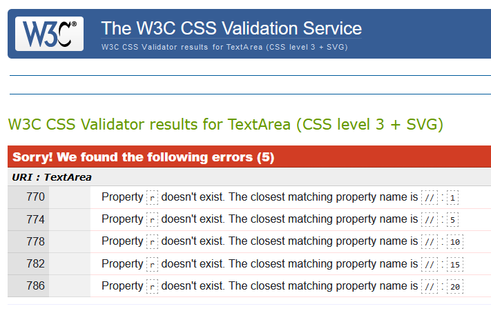

# Manual Testing

## Bugs

| **Bug**   | **Intended Outcome**  | **Issue**   | **Cause**   | **Solution**  | **Commit**  |
|---  |---  |---  |---  |---  |---  |
| #1  | Background image only covering part of the viewport.  | Background image not covering the entire viewport.  | Background image was attached to a `<section>`.   | Attaching the background image to the `<body>`.   | [55c91aa](https://github.com/Ryael/paradise-lost/commit/55c91aa76922aa5140ef12f5f5cddbcc37591eae)   |
| #2  | Error message should be contained with the menu.  | Error message was causing the contents of the menu to overflow.   | The `height` was set to a fixed amount and wasn't accounting for any error messages that would only show up if the user input any invalid data.   | Set the `height` to `fit-content`.  | [0b0f056](https://github.com/Ryael/paradise-lost/commit/0b0f056cb71361212647bdf378550ac4c17144)   |
| #3  | Enlist Now button sends the user to the dashboard.  | Even after the user was authenticated, the home button still read "Enlist Now" and directed the user towards registration.  | The button link was directing the user towards registration as there wasn't any check present to see if the user was already authenticated.   | Check to see if the user is authenticated, and if so, label the button "Dashboard" and direct them towards the Dashboard.   | [3842db3](https://github.com/Ryael/paradise-lost/commit/3842db3d6d66fc0d4dfb4472def74ef786cb491e)   |
| #4  | All buttons disappear from view when the fullscreen navigation menu is opened.  | Buttons were still visible and accessible while the fullscreen navigation menu was open.  | The z-index wasn't configured, causing the buttons to remain on-top of all content.   | `z-index:0` was added to the buttons but later this would be changed to giving the navigation-menu itself a higher `z-index`.   | [bdb7f37](https://github.com/Ryael/paradise-lost/commit/bdb7f378ae2fd850edc51a3b3e9dec42d0574191)   |
| #5  | Roster name field fits nicely in the provided table.  | Roster name field was able to break the provided table and overflow.  | The roster name field's maximum limit was originally set to a max of 255 characters.  | The roster's name field was set to 20 characters instead.   | [99a5f89](https://github.com/Ryael/paradise-lost/commit/99a5f89b929be9014e72b68b4f33cc1f9ddd9976)   |
| #6  | Upon loading into the home page, all text is displayed as intended.   | A layout shift was occurring due to the dynamically changing text.  | The area where the dynamically changing text was appearing was unaccounted for prior to the Javascript causing the cycle to start.  | Adding starting text to that empty field. In this case it was just "ARMY".  | [d6166b5](https://github.com/Ryael/paradise-lost/commit/d6166b5e8511bb9211b473fc2d15db17b2e23faa)   |
| #7  | Database models should be singular.   | Database models were written as plural mistakenly and migrated.   | The typo was the main reason for this error.  | Rolling back the database table fixed the issue.  | N/A   |
| #8  | Unregistered user should not be able to view the dashboard, rosters, or any of its pages.   | Unregistered user was able to view the dashboard, roster, and all its related pages.  | No check was implemented to see if the user was authenticated or not prior to letting them view those aforementioned pages.   | Adding `@login_required` on top of each relevant `views.py` function.   | [25ee051](https://github.com/Ryael/paradise-lost/commit/25ee051ad5bc922aa24988da850176e631ea308a)   |
| #9  | Page titles should be dynamic.  | Page titles were static, set to just "Home".  | The page title was set to be just "Home" within the `head.html` template.   | Adding `%blocktitle%` to the base and updating each page with the relevant page title.  | [82113ba](https://github.com/Ryael/paradise-lost/commit/82113ba9416ef43bb9944f9618e8d19b8835718f)   |
| #10   | Rosters should be sorted by their name on the Roster List page.   | Rosters were sorted by the date created and then the date modified when they were updated.  | The rosters were ordered by their default, which was the date the were last modified.   | Adding `.order_by("name")` to the views function to order them by their name.   | [63f97b8](https://github.com/Ryael/paradise-lost/commit/63f97b83eb44642070ef44d36072755e4f475151)   |
| #11   | The logo link should only cover the amount of space the logo covers.  | The logo link to the Home page covered the entire nav element.  | The `a` element was placed outside of the `h1` element.   | The `a` element was placed inside of the `h1` element.  | [87a6300](https://github.com/Ryael/paradise-lost/commit/87a6300aef692d6e595d9dc160c9530dc255de19)   |
| #12   | No horizontal scrollbars should appear at any point.  | Horizontal scrollbars were appearing in some places.  | The width of certain elements was set to `100vw`.   | Changing the `100vw` to `100%` for the width.   | [b8f168d](https://github.com/Ryael/paradise-lost/commit/b8f168d3be274f173e10eb4afc0bb16c59536187)   |
| #13   | The button corner decorators should always stick to the very corners of the Home page Call to Action button.  | The button corner decorators were slightly off for the top and bottom right corners.  | The div `#cta-button` was caused the right side decorators to be misplaced.   | Removing `#cta-button` div returned the right side decorators to their correct place.   | [c9fc63c](https://github.com/Ryael/paradise-lost/commit/c9fc63c4fddd228e048b467a6f76957108b3140d)   |
| #14   | WhiteNoise prevented error pages not displaying and prevent CSS from loading. | WhiteNoise was added to help with deployment.  | WhiteNoise caused server errors when `DEBUG_MODE` was set to `FALSE`.  | Uninstalling WhiteNoise and replacing it with Cloudinary fixed the CSS display issue and allowed custom error pages to display.   | [5ac22f9](https://github.com/Ryael/paradise-lost/commit/5ac22f9dcdc7cd00dd442bebe7fca67d95c9408a)   |

## Responsiveness

Mozilla Firefox's built-in Responsive Design Mode was to extensively test all aspects of Paradise Lost. It works on viewports as small as 350px.

## Accessibility

[WAVE WebAIM](https://wave.webaim.org/) was used to test the accessibility and it returned just one error and no contrast-errors.

- The error returned was that the button present in `navigation.html` was empty and required and `aria-label`, which was a simple fix.

## Performance

Google Lighthouse was used to assess the performance of this website. All tests were performed in incognito mode to avoid interference from any other sources. Tests were carried out on each section but the same result was returned every time. This was the same case for mobile, and as such, only one result will be provided.

## Validation

### HTML

[W3C Markup Validation Service](https://validator.w3.org/nu/) was used to validate all the HTML. Each file was checked by text input first and then by address afterwards. No errors were found, aside from errors pertaining to templating. A few warnings were flagged but this was assumed to be because of Django as well.

### CSS

[W3C CSS Validation Service](https://jigsaw.w3.org/css-validator/) was used to validate both CSS stylesheets. No errors were found for `form.css` but `style.css` showed errors for "Property r doesn't exist". However, after extensive research, this may just be that the validation tool is out of date. Property `r` refers to the radius of a circle and is often used in SVG designs. There's even a [CSS-Tricks page](https://css-tricks.com/svg-properties-and-css/) that covers the use of it. Additionally, it seems like the [VSCode linter](https://github.com/microsoft/vscode/issues/85828) also picks up on it incorrectly and has since 2019. The latest post was last month and it still seems to be an issue.

### JS

[JSHint](https://jshint.com/) was used to validate JavaScript code. It detected one unused variable, but that variable is indeed used and was hence left alone.

### PEP8

[PEP8 Code Institute Linter](https://pep8ci.herokuapp.com/#) was used to validate Python code. The only errors found were to do with lines being too long and those were all fixed. `settings.py` had a handful of line too long errors but as they were provided that same way by the base template and for fear of tampering with important configurations, these errors were left untouched.

## Device Testing

The website was tested on many different devices, such as:

- Samsung Galaxy S10
- Samsung Galaxy S21
- Samsung Galaxy Note 8
- MSI GE72 6QF Apache Pro
- iPhone 8
- iPhone 10
- iPhone 11
- iPhone 11 Pro
- iPhone 12
- iPhone 14 Pro Max
- iPad Mini (Landscape and Portrait)
- iPad (Landscape and Portrait)
- Vivo S1 Pro
- LG v60
- Huawei P40 Pro
- Google Pixel 6

## Browser Compatibility

- Mozilla Firefox
- Google Chrome
- Opera
- Safari
- Microsoft Edge

I tested the website extensively on Mozilla Firefox, Google Chrome, and Microsoft Edge. For the remaining two, I asked friends and family to test the website on my behalf while overlooking it to ensure cross-compatibility. No issues or bugs were reported.

### User Story Testing

1. As an unregistered user, I want to quickly understand the purpose of this website so that I can determine if I want to continue spending my time on this website and register.

  - Upon arriving at the landing page, the user is greeted by the hero video and dynamically changing text that informs the user of the purpose of the website.
  - The typography help to convey the feeling that this is a very futuristic, sci-fi, and army-focused website which should help the user infer its purpose.

2. As an unregistered user, I want to easily navigate the menu without getting lost and see the uniformity of each page so that I know this website is worth my time and won't lead to any frustrations.

  - The colour scheme is consistent throughout all pages, as are the menus which emulate an application-like approach that help familiarise the user with the website.
  - The navigation menu is sleek, clean, and simple. Everything is well laid-out and easy to understand.

3. As an unregistered user, I want to quickly and easily learn more about the website and its purpose if I am unable to infer its purpose from the visuals and text alone, so that I can decide if registering for this website would be beneficial to me.

  - After this point, the user is able to open the navigation menu if the visuals were engaging enough to open the "About" page, where they can find more detailed information about the purpose of this website in great detail.

4. As an unregistered user, I want to be able to register for an account so that I can start building my army rosters.

  - The home page has an "Enlist Now!" button that re-directs the user to the "Register" page, where they're able to easily and quickly make an account for the website.
  - The user is also able to access this page by opening the fullscreen navigation menu and navigating to the "Register" link in the middle of the screen.

5. As a registered user, I want to be able to change my password should I forget so that I have peace of mind in knowing that I won't be locked out of my account.

  - Upon opening the dashboard, the user is prompted to change their password. However, this assumes that they know what it was prior to this. If not, there's a highlighted link at the bottom of the page that re-direct them towards the "Forgot Your Password" page, where the user can reset their password via e-mail.
  - If the user registered without providing an e-mail, then they have the option of contacting the admin and asking them to help them change their password.
  - Alternatively, if the user was logged out, once they navigate to the "Login" page there'll be a link to "Reset" their password in case they forgot at the bottom of the menu, which brings them to the same place as above.

6. As a registered user, I want to be able to manage my account by changing my password so that I can avoid any security breaches or implement a stronger password.

  - Registered users are able to open their dashboard, which acts as their base of operations. Here they can find a "Change Your Password" button which re-directs them to the page of the same name. The user is able to change their password by first inputting their current password and their new, desired password twice.

7. As a registered user, I want to be made aware of my account management actions so that I know they have been successful.

  - Upon changing or updating their password, if the "Forgot Your Password" functionality was used then a page is displayed to inform the user's action was successful. If the "Change Your Password" functionality was used then a message is printed above the form to inform them that their password has been changed successfully.

8. As a registered user, I want to be able to access a user dashboard so that I have a base of operations for this website that's readily available.

  - Upon logging in or registering, the user is provided feedback that their action was successful by being brought to the "Dashboard" page.
  - They are greeted here with a "Welcome, Commander %USERNAME%!" to further inform that they're at the right place.
  - There are three buttons here which allow them to navigate to a) "My Rosters", b) "Change Your Password", c) "Logout" pages.
  - The "Dashboard" page is accessible from all parts of the website via the navigation menu once the user is logged in.

9. As a registered user, I want to be able to create my roster so that I can view it later.

  - From the "Dashboard" page, a user is able to navigate to the "My Rosters" page where they are greeted by a "Create Roster" button.
  - Upon interaction with this button, they are brought to another page where they're able to create a roster.
  - On this "Create Roster" page, once all the details are input and the button is interacted with, the user is brought back to the "My Rosters" page where a message is printed to let them a roster has been successfully created.

10. As a registered user, I want to be able to view my roster so that I can decide if it needs to have any changes made to it.

  - Users are able to view their current rosters via the "My Roster" page, which is available via the easily accessible "Dashboard".
  - Here a table is displayed of all the available rosters.
  - A user can interact with the "eye" icon to see a roster on its own.
  - Nothing else is possible here and the user is provided with a button to return back to their list of rosters.

11. As a registered user, I want to be able to update my roster so that I can make sure it's always up to date.

  - From the "My Roster" page where all the current rosters are displayed, beside each roster is three icons: an "eye", a "pen", and a "bin". The second is often used as an icon for the edit function, which is precisely what this icon does.
  - It re-directs the user to the "Edit Roster" page, where they can make changes to their roster of choice.
  - Upon confirmation of the changes, they're returned back to the roster list where a message is printed to inform them that their edit has been successful.

12. As a registered user, I want to be able to delete my roster so that any old or unnecessary rosters don't use any unnecessary space.

  - In the same way as above, a registered user is able to make all management actions on their rosters via the "My Rosters" page.
  - In this case, the focus is on the "bin" icon, which is commonly used as a delete button.
  - Interacting with it will re-direct the user to the "Delete Roster" page where the user is asked if they are sure that this is the roster they want to delete. The name of the roster will be bold and a button asking for their confirmed will be found below that.
  - Should they confirm, they'll be brought back to the "My Roster" page where there'll be one roster less and a message printed informing that roster has been deleted.

13. As an admin, I want to be able to log into an admin interface so that I can view, add, update, or delete information pertaining to the army rosters.

  - Django's provided admin interface makes it very quick and simple to login, manage data however you may wish to.
  - This, however, is limited to how your models are set-up.

14. As an admin, I want to be able to access the users for the website so that I can make any adjustments to their accounts such as changing their password or email, should they request it.

  - The built-in admin interface is very powerful and offers powerful user management tools.
  - Admins are able to change a user's username, first name, last name, email address, permissions, groups, password, as well as their latest login and date of registration.

15. As an admin, I want to be able to view a list of the users so that I know how many active users there are.

  - Simply by navigating to the "User" portion of the admin panel, an admin is quickly and easily able to see exactly how many users have registered on their website and how many of them are active.

16. As a site user, I want to be engaged by the user interface, indicating I will enjoy spending time building my rosters as I navigate the same menus repeatedly.

  - The menus were all built in such a way that it feels cohesive and everything leads to another. Buttons are snappy and quick, with animations playing very quickly.
  - When one has to navigate lots of menus quickly, it's equally important that said menus are well-designed and responsive.
  - The designs are also consistent throughout, with each part of the website complementing each other.

17. As a site user, I want to be shown responses from the website upon interaction with it so that I know the creation, deletion, or update of my roster has been successful.

  - Upon any of the successful edit, create, and delete roster actions, the user is brought back to the "My Rosters" page, where the relevant message is printed just below the title of the page so as to inform them their action has been carried out.

18. As a site user, I want to experience a unique and uniform design with appealing colours so that every part of the website stimulates a positive response.

  - The user interface was built with a very sleek and futuristic theme in mind that's supposed to evoke feelings of sci-fi war-games with its buttons, hero-video, and dot-like backgrounds. Design was put on the forefront to engage the user as much as possible and maximise user conversion.

19. As a site user, I want to be able to access the website from any screen size and still have a pleasant viewing experience, so that I'm not restricted to only viewing this website on bigger screens.

  - This website has been optimised for all viewports, even for mobiles with widths as small as 350px.
  - Generally speaking, these sort of websites tend to lend themselves well to bigger screens due to the amount of data they display, but this data has been styled in such a way that the data displays nicely even at smaller viewports.

20. As a site user, I want to be able to contact the admin via e-mail, find their GitHub project repository, or even find them on other socials like LinkedIn.

  - Any user is able to find the admin's socials via the navigation menu, which is always available to them.
  - There they can find the admin's LinkedIn, GitHub, and their e-mail.

[Back to Readme](https://github.com/Ryael/paradise-lost)
